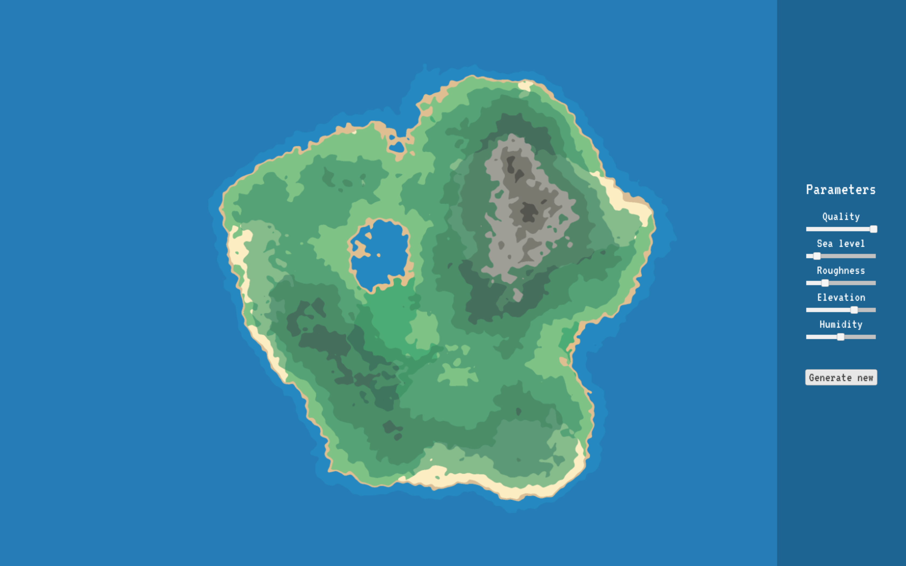
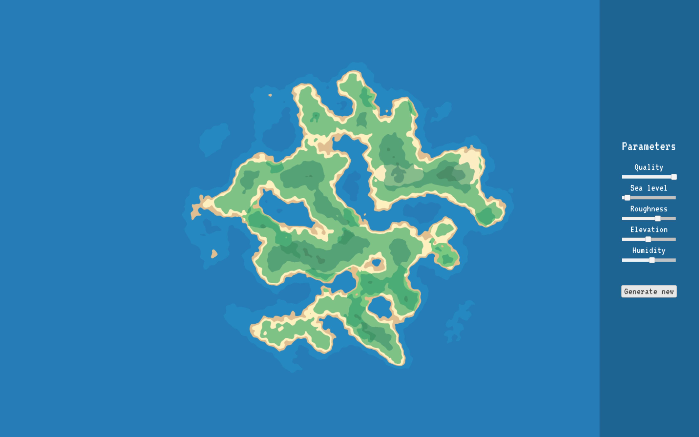
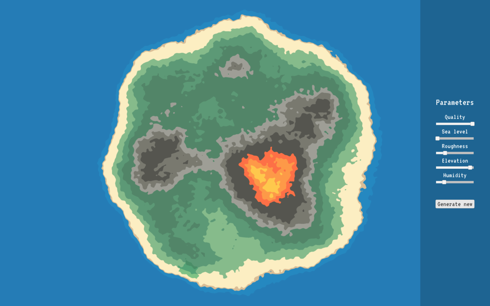
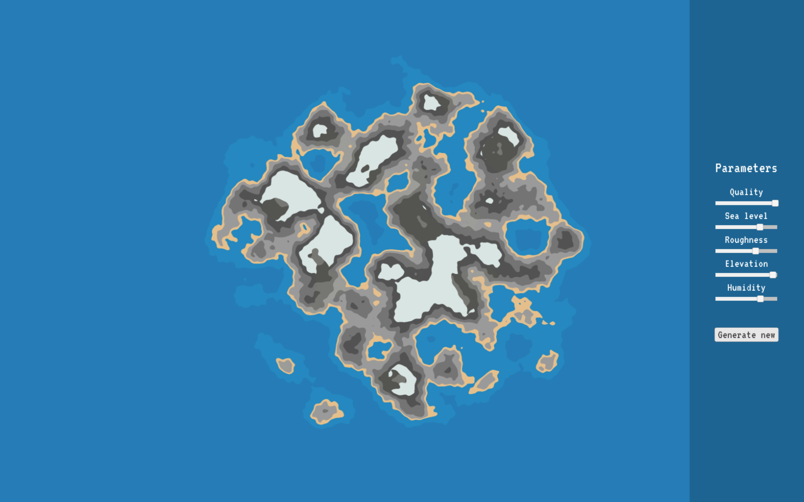

# 2D Terrain Generator

## About the project

Unity WebGL application that gives you a set of parameters to create your own islands. The terrain is generated based on Perlin Noise and various modifications to it.

## How to run

You can open the application in the browser under [this link.](https://tomaszfijalkowski.github.io/2d-terrain-generator/)

## Showcase

Generic Island:

Shattered Island:

Volcano Island:

Rocky Island:

